# Exploration Data Analysis


<!-- WARNING: THIS FILE WAS AUTOGENERATED! DO NOT EDIT! -->

``` python
import fastai
print(fastai.__version__)
```

    2.8.4

------------------------------------------------------------------------

<a
href="https://github.com/marcomatteo/steel_segmentation/tree/master/blob/master/steel_segmentation/utils.py#L24"
target="_blank" style="float:right; font-size:smaller">source</a>

### seed_everything

>  seed_everything (seed=69)

*Seeds `random`, `os.environ["PYTHONHASHSEED"]`, `numpy`, `torch.cuda`
and `torch.backends`.*

## Data structure

------------------------------------------------------------------------

<a
href="https://github.com/marcomatteo/steel_segmentation/tree/master/blob/master/steel_segmentation/utils.py#L37"
target="_blank" style="float:right; font-size:smaller">source</a>

### print_competition_data

>  print_competition_data (p:pathlib.Path)

``` python
path = Path("../data/")
```

The `path` variable is a `os.pathlib.Path` object that points to the
competition data.

To print all the files this directory use the
[`print_competition_data`](https://marcomatteo.github.io/steel_segmentation/eda.html#print_competition_data)
function.

``` python
print_competition_data(path)
```

    ..\data\hard_negatives_patterns.txt
    ..\data\predictions
    ..\data\sample_submission.csv
    ..\data\submissions
    ..\data\test_images
    ..\data\train.csv
    ..\data\train_images

The competition files in detail:

- **train_images/** - folder of training images (12.5k images)
- **test_images/** - folder of test images to segment and classify (5506
  images)
- **train.csv** - training annotations which provide segments for
  defects (`ClassId = [1, 2, 3, 4]`)
- **sample_submission.csv** - a sample submission file in the correct
  format; note, each `ImageId` 4 rows, one for each of the 4 defect
  classes

``` python
train_path = path/"train_images"
test_path = path/"test_images"
train_pfiles = get_image_files(train_path)
test_pfiles = get_image_files(test_path)
```

## Training data

The training data includes:

- faulty images: images that have at least one defect

- hard negative images: images with no defects

``` python
train_pfiles
```

    (#12568) [Path('../data/train_images/0002cc93b.jpg'),Path('../data/train_images/00031f466.jpg'),Path('../data/train_images/000418bfc.jpg'),Path('../data/train_images/000789191.jpg'),Path('../data/train_images/0007a71bf.jpg'),Path('../data/train_images/000a4bcdd.jpg'),Path('../data/train_images/000f6bf48.jpg'),Path('../data/train_images/0014fce06.jpg'),Path('../data/train_images/001982b08.jpg'),Path('../data/train_images/001d1b355.jpg')...]

The
[`get_train_df`](https://marcomatteo.github.io/steel_segmentation/eda.html#get_train_df)
function returns the DataFrame from the `train.csv` file, only faulty
image names if `only_faulty`, with the training images metadata: -
**ImageId**: image name

- **ClassId**: the class type

- **EncodedPixels**: the encoded pixels follows a run-length encoding
  rule, a sequence of pair values that contains a start position and a
  run length with the space as the delimiter. E.g. `1 3 10 5` means
  pixels `(1,2,3)` and `(10,11,12,13,14)`.

Each Image may have no defects, a single defect, or multiple defects.

------------------------------------------------------------------------

<a
href="https://github.com/marcomatteo/steel_segmentation/tree/master/blob/master/steel_segmentation/utils.py#L61"
target="_blank" style="float:right; font-size:smaller">source</a>

### get_train_df

>  get_train_df (path, only_faulty=False, pivot=False, hard_negatives=False)

*Get training DataFrame with all the images in data/train_images.
Returns only the faulty images if `only_faulty`.*

------------------------------------------------------------------------

<a
href="https://github.com/marcomatteo/steel_segmentation/tree/master/blob/master/steel_segmentation/utils.py#L42"
target="_blank" style="float:right; font-size:smaller">source</a>

### get_train_pivot

>  get_train_pivot (df)

*Summarize the training csv with ClassId as columns and values
EncodedPixels*

### Hard negatives with patterns

``` python
hard_neg_patterns = pd.read_csv(
    path/"hard_negatives_patterns.txt", header=None, names=["ImageId"])
```

``` python
hard_neg_patterns.head()
```

<div>
<style scoped>
    .dataframe tbody tr th:only-of-type {
        vertical-align: middle;
    }
&#10;    .dataframe tbody tr th {
        vertical-align: top;
    }
&#10;    .dataframe thead th {
        text-align: right;
    }
</style>

<table class="dataframe" data-quarto-postprocess="true" data-border="1">
<thead>
<tr style="text-align: right;">
<th data-quarto-table-cell-role="th"></th>
<th data-quarto-table-cell-role="th">ImageId</th>
</tr>
</thead>
<tbody>
<tr>
<td data-quarto-table-cell-role="th">0</td>
<td>000789191.jpg</td>
</tr>
<tr>
<td data-quarto-table-cell-role="th">1</td>
<td>00d7ae946.jpg</td>
</tr>
<tr>
<td data-quarto-table-cell-role="th">2</td>
<td>01b237ab8.jpg</td>
</tr>
<tr>
<td data-quarto-table-cell-role="th">3</td>
<td>01d590c5f.jpg</td>
</tr>
<tr>
<td data-quarto-table-cell-role="th">4</td>
<td>01e501f99.jpg</td>
</tr>
</tbody>
</table>

</div>

In `hard_neg_patterns` there are the `ImageId`s of training images with
some patterns (from this
[kernel](https://www.kaggle.com/ateplyuk/detector-steels-with-texture/data)).

``` python
train = get_train_df(path, only_faulty=False)
assert isinstance(train, pd.DataFrame)
train_faulty = train.loc[train["status"]=="faulty"]
assert not train.ImageId_ClassId.duplicated().any(), "Found ImageId_ClassId duplicates"
```

``` python
train.describe(include='all')[:4]
```

<div>
<style scoped>
    .dataframe tbody tr th:only-of-type {
        vertical-align: middle;
    }
&#10;    .dataframe tbody tr th {
        vertical-align: top;
    }
&#10;    .dataframe thead th {
        text-align: right;
    }
</style>

<table class="dataframe" data-quarto-postprocess="true" data-border="1">
<thead>
<tr style="text-align: right;">
<th data-quarto-table-cell-role="th"></th>
<th data-quarto-table-cell-role="th">ImageId</th>
<th data-quarto-table-cell-role="th">ClassId</th>
<th data-quarto-table-cell-role="th">EncodedPixels</th>
<th data-quarto-table-cell-role="th">status</th>
<th data-quarto-table-cell-role="th">ImageId_ClassId</th>
</tr>
</thead>
<tbody>
<tr>
<td data-quarto-table-cell-role="th">count</td>
<td>12997</td>
<td>12997.0</td>
<td>12997.0</td>
<td>12997</td>
<td>12997</td>
</tr>
<tr>
<td data-quarto-table-cell-role="th">unique</td>
<td>12568</td>
<td>NaN</td>
<td>7096.0</td>
<td>2</td>
<td>12997</td>
</tr>
<tr>
<td data-quarto-table-cell-role="th">top</td>
<td>ef24da2ba.jpg</td>
<td>NaN</td>
<td>-1.0</td>
<td>faulty</td>
<td>0002cc93b.jpg_1</td>
</tr>
<tr>
<td data-quarto-table-cell-role="th">freq</td>
<td>3</td>
<td>NaN</td>
<td>5902.0</td>
<td>7095</td>
<td>1</td>
</tr>
</tbody>
</table>

</div>

``` python
print(train.shape)
train.head(2)
```

    (12997, 5)

<div>
<style scoped>
    .dataframe tbody tr th:only-of-type {
        vertical-align: middle;
    }
&#10;    .dataframe tbody tr th {
        vertical-align: top;
    }
&#10;    .dataframe thead th {
        text-align: right;
    }
</style>

<table class="dataframe" data-quarto-postprocess="true" data-border="1">
<thead>
<tr style="text-align: right;">
<th data-quarto-table-cell-role="th"></th>
<th data-quarto-table-cell-role="th">ImageId</th>
<th data-quarto-table-cell-role="th">ClassId</th>
<th data-quarto-table-cell-role="th">EncodedPixels</th>
<th data-quarto-table-cell-role="th">status</th>
<th data-quarto-table-cell-role="th">ImageId_ClassId</th>
</tr>
</thead>
<tbody>
<tr>
<td data-quarto-table-cell-role="th">0</td>
<td>0002cc93b.jpg</td>
<td>1</td>
<td>29102 12 29346 24 29602 24 29858 24 30114 24 30370 24 30626 24 30882
24 31139 23 31395 23 31651 23 31907 23 32163 23 32419 23 32675 23 77918
27 78174 55 78429 60 78685 64 78941 68 79197 72 79452 77 79708 81 79964
85 80220 89 80475 94 80731 98 80987 102 81242 105 81498 105 81754 104
82010 104 82265 105 82521 31 82556 69 82779 27 82818 63 83038 22 83080
57 83297 17 83342 50 83555 13 83604 44 83814 8 83866 37 84073 3 84128 31
84390 25 84652 18 84918 8 85239 10 85476 29 85714 47 85960 57 86216 57
86471 58 86727 58 86983 58 87238 59 87494 59 87750 59 88005 60 88261 60
88517 60 88772 61 89028 53...</td>
<td>faulty</td>
<td>0002cc93b.jpg_1</td>
</tr>
<tr>
<td data-quarto-table-cell-role="th">1</td>
<td>00031f466.jpg</td>
<td>0</td>
<td>-1</td>
<td>no_faulty</td>
<td>00031f466.jpg_0</td>
</tr>
</tbody>
</table>

</div>

``` python
missing_imgs = train["ImageId"].map(lambda x: not ((path/"train_images"/str(x)).is_file()))
print(missing_imgs.sum())
```

    0

``` python
print(train_faulty.shape)
train_faulty.head(2)
```

    (7095, 5)

<div>
<style scoped>
    .dataframe tbody tr th:only-of-type {
        vertical-align: middle;
    }
&#10;    .dataframe tbody tr th {
        vertical-align: top;
    }
&#10;    .dataframe thead th {
        text-align: right;
    }
</style>

<table class="dataframe" data-quarto-postprocess="true" data-border="1">
<thead>
<tr style="text-align: right;">
<th data-quarto-table-cell-role="th"></th>
<th data-quarto-table-cell-role="th">ImageId</th>
<th data-quarto-table-cell-role="th">ClassId</th>
<th data-quarto-table-cell-role="th">EncodedPixels</th>
<th data-quarto-table-cell-role="th">status</th>
<th data-quarto-table-cell-role="th">ImageId_ClassId</th>
</tr>
</thead>
<tbody>
<tr>
<td data-quarto-table-cell-role="th">0</td>
<td>0002cc93b.jpg</td>
<td>1</td>
<td>29102 12 29346 24 29602 24 29858 24 30114 24 30370 24 30626 24 30882
24 31139 23 31395 23 31651 23 31907 23 32163 23 32419 23 32675 23 77918
27 78174 55 78429 60 78685 64 78941 68 79197 72 79452 77 79708 81 79964
85 80220 89 80475 94 80731 98 80987 102 81242 105 81498 105 81754 104
82010 104 82265 105 82521 31 82556 69 82779 27 82818 63 83038 22 83080
57 83297 17 83342 50 83555 13 83604 44 83814 8 83866 37 84073 3 84128 31
84390 25 84652 18 84918 8 85239 10 85476 29 85714 47 85960 57 86216 57
86471 58 86727 58 86983 58 87238 59 87494 59 87750 59 88005 60 88261 60
88517 60 88772 61 89028 53...</td>
<td>faulty</td>
<td>0002cc93b.jpg_1</td>
</tr>
<tr>
<td data-quarto-table-cell-role="th">4</td>
<td>0007a71bf.jpg</td>
<td>3</td>
<td>18661 28 18863 82 19091 110 19347 110 19603 110 19859 110 20115 110
20371 110 20627 110 20883 110 21139 110 21395 110 21651 110 21962 55
293125 251 293381 251 293637 251 293893 251 294149 251 294405 251 294661
251 294917 251 295173 251 295429 251 295685 251 295941 251 296197 251
296453 251 296709 251 296965 251 297221 251 297477 251 297733 251 297989
251 298245 251 298564 188 298945 63</td>
<td>faulty</td>
<td>0007a71bf.jpg_3</td>
</tr>
</tbody>
</table>

</div>

------------------------------------------------------------------------

<a
href="https://github.com/marcomatteo/steel_segmentation/tree/master/blob/master/steel_segmentation/utils.py#L102"
target="_blank" style="float:right; font-size:smaller">source</a>

### count_pct

>  count_pct (df, column='ClassId')

*Returns a `pandas.DataFrame` with count and frequencies stats for
`column`.*

The `ClassId` column values from `train` are:

``` python
class_count = count_pct(train)
class_count
```

<div>
<style scoped>
    .dataframe tbody tr th:only-of-type {
        vertical-align: middle;
    }
&#10;    .dataframe tbody tr th {
        vertical-align: top;
    }
&#10;    .dataframe thead th {
        text-align: right;
    }
</style>

<table class="dataframe" data-quarto-postprocess="true" data-border="1">
<thead>
<tr style="text-align: right;">
<th data-quarto-table-cell-role="th"></th>
<th data-quarto-table-cell-role="th">num</th>
<th data-quarto-table-cell-role="th">freq</th>
</tr>
<tr>
<th data-quarto-table-cell-role="th">ClassId</th>
<th data-quarto-table-cell-role="th"></th>
<th data-quarto-table-cell-role="th"></th>
</tr>
</thead>
<tbody>
<tr>
<td data-quarto-table-cell-role="th">0</td>
<td>5902</td>
<td>0.454105</td>
</tr>
<tr>
<td data-quarto-table-cell-role="th">1</td>
<td>897</td>
<td>0.069016</td>
</tr>
<tr>
<td data-quarto-table-cell-role="th">2</td>
<td>247</td>
<td>0.019004</td>
</tr>
<tr>
<td data-quarto-table-cell-role="th">3</td>
<td>5150</td>
<td>0.396245</td>
</tr>
<tr>
<td data-quarto-table-cell-role="th">4</td>
<td>801</td>
<td>0.061630</td>
</tr>
</tbody>
</table>

</div>

``` python
class_count["num"].plot.bar(title="Defects by ClassId count");
```

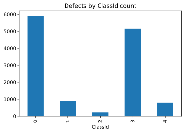

Images have at least one defect and there’s a small number of images
with two or three defects.

``` python
counts = train_faulty["ImageId"].value_counts()

hist_counts, _ = np.histogram(counts.values, bins=3)
nums = ['1', '2', '3']
plt.bar(x=nums, height=hist_counts)
plt.title("Num of defects per images")
plt.show()

{i+1: c for i, c in enumerate(hist_counts)}
```


    {1: 6239, 2: 425, 3: 2}

``` python
unique_imgs = train_faulty.describe(include='all')["ImageId"].T[:2]
unique_imgs
```

    count     7095
    unique    6666
    Name: ImageId, dtype: object

``` python
fig, ax = plt.subplots(1, 1, figsize=(7, 6.5))
ax.set_title("Count imgs", pad=30, fontdict={'fontsize': 14})
ax.xaxis.tick_top()  # Display x-axis ticks on top

(
    train[['ImageId', 'status']]
    .drop_duplicates()
    .status.value_counts().iloc[:-1]
    .plot.barh(table=True, ax=ax)
)
plt.show()
```

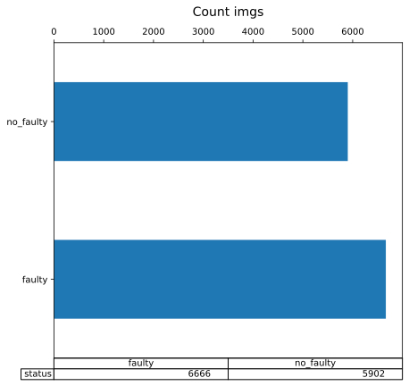

## Train transforms

Loading the images for models requires some transformations to the
DataFrames.

### Pivot RLE encodings

The
[`get_train_pivot`](https://marcomatteo.github.io/steel_segmentation/eda.html#get_train_pivot)
is the pivoted version of `df`. All the images are in the index, for
each image the `ClassId` encoding values are in the columns.

``` python
train_pivot = get_train_df(path, pivot=True)
```

``` python
train_pivot.head(2)
```

<div>
<style scoped>
    .dataframe tbody tr th:only-of-type {
        vertical-align: middle;
    }
&#10;    .dataframe tbody tr th {
        vertical-align: top;
    }
&#10;    .dataframe thead th {
        text-align: right;
    }
</style>

<table class="dataframe" data-quarto-postprocess="true" data-border="1">
<thead>
<tr style="text-align: right;">
<th data-quarto-table-cell-role="th">ClassId</th>
<th data-quarto-table-cell-role="th">0</th>
<th data-quarto-table-cell-role="th">1</th>
<th data-quarto-table-cell-role="th">2</th>
<th data-quarto-table-cell-role="th">3</th>
<th data-quarto-table-cell-role="th">4</th>
<th data-quarto-table-cell-role="th">n</th>
<th data-quarto-table-cell-role="th">ClassIds</th>
</tr>
<tr>
<th data-quarto-table-cell-role="th">ImageId</th>
<th data-quarto-table-cell-role="th"></th>
<th data-quarto-table-cell-role="th"></th>
<th data-quarto-table-cell-role="th"></th>
<th data-quarto-table-cell-role="th"></th>
<th data-quarto-table-cell-role="th"></th>
<th data-quarto-table-cell-role="th"></th>
<th data-quarto-table-cell-role="th"></th>
</tr>
</thead>
<tbody>
<tr>
<td data-quarto-table-cell-role="th">0002cc93b.jpg</td>
<td>NaN</td>
<td>29102 12 29346 24 29602 24 29858 24 30114 24 30370 24 30626 24 30882
24 31139 23 31395 23 31651 23 31907 23 32163 23 32419 23 32675 23 77918
27 78174 55 78429 60 78685 64 78941 68 79197 72 79452 77 79708 81 79964
85 80220 89 80475 94 80731 98 80987 102 81242 105 81498 105 81754 104
82010 104 82265 105 82521 31 82556 69 82779 27 82818 63 83038 22 83080
57 83297 17 83342 50 83555 13 83604 44 83814 8 83866 37 84073 3 84128 31
84390 25 84652 18 84918 8 85239 10 85476 29 85714 47 85960 57 86216 57
86471 58 86727 58 86983 58 87238 59 87494 59 87750 59 88005 60 88261 60
88517 60 88772 61 89028 53...</td>
<td>NaN</td>
<td>NaN</td>
<td>NaN</td>
<td>1</td>
<td>1</td>
</tr>
<tr>
<td data-quarto-table-cell-role="th">00031f466.jpg</td>
<td>-1</td>
<td>NaN</td>
<td>NaN</td>
<td>NaN</td>
<td>NaN</td>
<td>1</td>
<td>0</td>
</tr>
</tbody>
</table>

</div>

``` python
count_pct(train_pivot, column='n')
```

<div>
<style scoped>
    .dataframe tbody tr th:only-of-type {
        vertical-align: middle;
    }
&#10;    .dataframe tbody tr th {
        vertical-align: top;
    }
&#10;    .dataframe thead th {
        text-align: right;
    }
</style>

<table class="dataframe" data-quarto-postprocess="true" data-border="1">
<thead>
<tr style="text-align: right;">
<th data-quarto-table-cell-role="th"></th>
<th data-quarto-table-cell-role="th">num</th>
<th data-quarto-table-cell-role="th">freq</th>
</tr>
<tr>
<th data-quarto-table-cell-role="th">n</th>
<th data-quarto-table-cell-role="th"></th>
<th data-quarto-table-cell-role="th"></th>
</tr>
</thead>
<tbody>
<tr>
<td data-quarto-table-cell-role="th">1</td>
<td>12141</td>
<td>0.966025</td>
</tr>
<tr>
<td data-quarto-table-cell-role="th">2</td>
<td>425</td>
<td>0.033816</td>
</tr>
<tr>
<td data-quarto-table-cell-role="th">3</td>
<td>2</td>
<td>0.000159</td>
</tr>
</tbody>
</table>

</div>

``` python
count_pct(train_pivot, column='ClassIds').sort_values("freq")
```

<div>
<style scoped>
    .dataframe tbody tr th:only-of-type {
        vertical-align: middle;
    }
&#10;    .dataframe tbody tr th {
        vertical-align: top;
    }
&#10;    .dataframe thead th {
        text-align: right;
    }
</style>

<table class="dataframe" data-quarto-postprocess="true" data-border="1">
<thead>
<tr style="text-align: right;">
<th data-quarto-table-cell-role="th"></th>
<th data-quarto-table-cell-role="th">num</th>
<th data-quarto-table-cell-role="th">freq</th>
</tr>
<tr>
<th data-quarto-table-cell-role="th">ClassIds</th>
<th data-quarto-table-cell-role="th"></th>
<th data-quarto-table-cell-role="th"></th>
</tr>
</thead>
<tbody>
<tr>
<td data-quarto-table-cell-role="th">2 4</td>
<td>1</td>
<td>0.000080</td>
</tr>
<tr>
<td data-quarto-table-cell-role="th">1 2 3</td>
<td>2</td>
<td>0.000159</td>
</tr>
<tr>
<td data-quarto-table-cell-role="th">2 3</td>
<td>14</td>
<td>0.001114</td>
</tr>
<tr>
<td data-quarto-table-cell-role="th">1 2</td>
<td>35</td>
<td>0.002785</td>
</tr>
<tr>
<td data-quarto-table-cell-role="th">1 3</td>
<td>91</td>
<td>0.007241</td>
</tr>
<tr>
<td data-quarto-table-cell-role="th">2</td>
<td>195</td>
<td>0.015516</td>
</tr>
<tr>
<td data-quarto-table-cell-role="th">3 4</td>
<td>284</td>
<td>0.022597</td>
</tr>
<tr>
<td data-quarto-table-cell-role="th">4</td>
<td>516</td>
<td>0.041057</td>
</tr>
<tr>
<td data-quarto-table-cell-role="th">1</td>
<td>769</td>
<td>0.061187</td>
</tr>
<tr>
<td data-quarto-table-cell-role="th">3</td>
<td>4759</td>
<td>0.378660</td>
</tr>
<tr>
<td data-quarto-table-cell-role="th">0</td>
<td>5902</td>
<td>0.469605</td>
</tr>
</tbody>
</table>

</div>

### Multi class defects

The
[`get_classification_df`](https://marcomatteo.github.io/steel_segmentation/eda.html#get_classification_df)
allows to build a DataFrame to classification models. In `ClassId_multi`
are listed the `ClassId`s separated by a space.

------------------------------------------------------------------------

<a
href="https://github.com/marcomatteo/steel_segmentation/tree/master/blob/master/steel_segmentation/utils.py#L111"
target="_blank" style="float:right; font-size:smaller">source</a>

### get_classification_df

>  get_classification_df (df:pandas.core.frame.DataFrame)

*Get the DataFrame for the multiclass classification model*

``` python
train_multi = get_classification_df(train)
train_multi.head()
```

<div>
<style scoped>
    .dataframe tbody tr th:only-of-type {
        vertical-align: middle;
    }
&#10;    .dataframe tbody tr th {
        vertical-align: top;
    }
&#10;    .dataframe thead th {
        text-align: right;
    }
</style>

<table class="dataframe" data-quarto-postprocess="true" data-border="1">
<thead>
<tr style="text-align: right;">
<th data-quarto-table-cell-role="th">ClassId</th>
<th data-quarto-table-cell-role="th">ImageId</th>
<th data-quarto-table-cell-role="th">ClassId_multi</th>
</tr>
</thead>
<tbody>
<tr>
<td data-quarto-table-cell-role="th">0</td>
<td>0002cc93b.jpg</td>
<td>1</td>
</tr>
<tr>
<td data-quarto-table-cell-role="th">1</td>
<td>00031f466.jpg</td>
<td>0</td>
</tr>
<tr>
<td data-quarto-table-cell-role="th">2</td>
<td>000418bfc.jpg</td>
<td>0</td>
</tr>
<tr>
<td data-quarto-table-cell-role="th">3</td>
<td>000789191.jpg</td>
<td>0</td>
</tr>
<tr>
<td data-quarto-table-cell-role="th">4</td>
<td>0007a71bf.jpg</td>
<td>3</td>
</tr>
</tbody>
</table>

</div>

``` python
count_pct(train_multi, column='ClassId_multi').sort_values("freq", ascending=False)
```

<div>
<style scoped>
    .dataframe tbody tr th:only-of-type {
        vertical-align: middle;
    }
&#10;    .dataframe tbody tr th {
        vertical-align: top;
    }
&#10;    .dataframe thead th {
        text-align: right;
    }
</style>

<table class="dataframe" data-quarto-postprocess="true" data-border="1">
<thead>
<tr style="text-align: right;">
<th data-quarto-table-cell-role="th"></th>
<th data-quarto-table-cell-role="th">num</th>
<th data-quarto-table-cell-role="th">freq</th>
</tr>
<tr>
<th data-quarto-table-cell-role="th">ClassId_multi</th>
<th data-quarto-table-cell-role="th"></th>
<th data-quarto-table-cell-role="th"></th>
</tr>
</thead>
<tbody>
<tr>
<td data-quarto-table-cell-role="th">0</td>
<td>5902</td>
<td>0.469605</td>
</tr>
<tr>
<td data-quarto-table-cell-role="th">3</td>
<td>4759</td>
<td>0.378660</td>
</tr>
<tr>
<td data-quarto-table-cell-role="th">1</td>
<td>769</td>
<td>0.061187</td>
</tr>
<tr>
<td data-quarto-table-cell-role="th">4</td>
<td>516</td>
<td>0.041057</td>
</tr>
<tr>
<td data-quarto-table-cell-role="th">3 4</td>
<td>284</td>
<td>0.022597</td>
</tr>
<tr>
<td data-quarto-table-cell-role="th">2</td>
<td>195</td>
<td>0.015516</td>
</tr>
<tr>
<td data-quarto-table-cell-role="th">1 3</td>
<td>91</td>
<td>0.007241</td>
</tr>
<tr>
<td data-quarto-table-cell-role="th">1 2</td>
<td>35</td>
<td>0.002785</td>
</tr>
<tr>
<td data-quarto-table-cell-role="th">2 3</td>
<td>14</td>
<td>0.001114</td>
</tr>
<tr>
<td data-quarto-table-cell-role="th">1 2 3</td>
<td>2</td>
<td>0.000159</td>
</tr>
<tr>
<td data-quarto-table-cell-role="th">2 4</td>
<td>1</td>
<td>0.000080</td>
</tr>
</tbody>
</table>

</div>

``` python
train_multi.describe(include='all')
```

<div>
<style scoped>
    .dataframe tbody tr th:only-of-type {
        vertical-align: middle;
    }
&#10;    .dataframe tbody tr th {
        vertical-align: top;
    }
&#10;    .dataframe thead th {
        text-align: right;
    }
</style>

<table class="dataframe" data-quarto-postprocess="true" data-border="1">
<thead>
<tr style="text-align: right;">
<th data-quarto-table-cell-role="th">ClassId</th>
<th data-quarto-table-cell-role="th">ImageId</th>
<th data-quarto-table-cell-role="th">ClassId_multi</th>
</tr>
</thead>
<tbody>
<tr>
<td data-quarto-table-cell-role="th">count</td>
<td>12568</td>
<td>12568</td>
</tr>
<tr>
<td data-quarto-table-cell-role="th">unique</td>
<td>12568</td>
<td>11</td>
</tr>
<tr>
<td data-quarto-table-cell-role="th">top</td>
<td>0002cc93b.jpg</td>
<td>0</td>
</tr>
<tr>
<td data-quarto-table-cell-role="th">freq</td>
<td>1</td>
<td>5902</td>
</tr>
</tbody>
</table>

</div>

## Test data

``` python
test_pfiles
```

    (#5506) [Path('../data/test_images/0000f269f.jpg'),Path('../data/test_images/000ccc2ac.jpg'),Path('../data/test_images/002451917.jpg'),Path('../data/test_images/003c5da97.jpg'),Path('../data/test_images/0042e163f.jpg'),Path('../data/test_images/004f40c73.jpg'),Path('../data/test_images/00513039a.jpg'),Path('../data/test_images/006f39c41.jpg'),Path('../data/test_images/008725cbc.jpg'),Path('../data/test_images/0098ca44e.jpg')...]

``` python
test_df = pd.read_csv(path / 'sample_submission.csv')
test_df.head()
```

<div>
<style scoped>
    .dataframe tbody tr th:only-of-type {
        vertical-align: middle;
    }
&#10;    .dataframe tbody tr th {
        vertical-align: top;
    }
&#10;    .dataframe thead th {
        text-align: right;
    }
</style>

<table class="dataframe" data-quarto-postprocess="true" data-border="1">
<thead>
<tr style="text-align: right;">
<th data-quarto-table-cell-role="th"></th>
<th data-quarto-table-cell-role="th">ImageId</th>
<th data-quarto-table-cell-role="th">EncodedPixels</th>
<th data-quarto-table-cell-role="th">ClassId</th>
</tr>
</thead>
<tbody>
<tr>
<td data-quarto-table-cell-role="th">0</td>
<td>0000f269f.jpg</td>
<td>1 409600</td>
<td>0</td>
</tr>
<tr>
<td data-quarto-table-cell-role="th">1</td>
<td>000ccc2ac.jpg</td>
<td>1 409600</td>
<td>0</td>
</tr>
<tr>
<td data-quarto-table-cell-role="th">2</td>
<td>002451917.jpg</td>
<td>1 409600</td>
<td>0</td>
</tr>
<tr>
<td data-quarto-table-cell-role="th">3</td>
<td>003c5da97.jpg</td>
<td>1 409600</td>
<td>0</td>
</tr>
<tr>
<td data-quarto-table-cell-role="th">4</td>
<td>0042e163f.jpg</td>
<td>1 409600</td>
<td>0</td>
</tr>
</tbody>
</table>

</div>

## Class Defects

``` python
def old_rle2mask(rle: str, value: int, shape):
    """
    From a RLE encoded pixels returns a mask
    with `value` for defected pixels
    (e.g. `value`=1 so 1 -> defected, 0 -> groundtruth)
    and `shape` as tuple (height, width).
    """
    assert len(shape) == 2, "The shape must be (height, width)"
    assert isinstance(shape[0], int)
    assert isinstance(shape[1], int)

    h, w = shape
    mask = np.zeros(h * w, dtype=np.uint8)

    rle = rle.split(" ")
    positions = map(int, rle[0::2])
    length = map(int, rle[1::2])

    for pos, le in zip(positions, length):
        mask[pos:(pos + le)] = value

    return mask.reshape(h, w, order='F')
```

------------------------------------------------------------------------

<a
href="https://github.com/marcomatteo/steel_segmentation/tree/master/blob/master/steel_segmentation/utils.py#L137"
target="_blank" style="float:right; font-size:smaller">source</a>

### rle2mask

>  rle2mask (rle, value=1, shape=(256, 1600))

*mask_rle: run-length as string formated (start length) shape:
(width,height) of array to return Returns numpy array, 1 - mask, 0 -
background Source:
https://www.kaggle.com/paulorzp/rle-functions-run-lenght-encode-decode*

``` python
item = train_faulty.iloc[1]
item_class_id = item["ClassId"]
item_rle = item["EncodedPixels"]
item_rle[:50]
```

    '18661 28 18863 82 19091 110 19347 110 19603 110 19'

``` python
s = item_rle.split()
how_many_values = 10
pixels = s[0:][::2]
lengths = s[1:][::2]
(pixels[:how_many_values], lengths[:how_many_values])
```

    (['18661',
      '18863',
      '19091',
      '19347',
      '19603',
      '19859',
      '20115',
      '20371',
      '20627',
      '20883'],
     ['28', '82', '110', '110', '110', '110', '110', '110', '110', '110'])

``` python
starts, lengths = [np.asarray(x, dtype=int) for x in (s[0:][::2], s[1:][::2])]
starts -= 1
starts, lengths
```

    (array([ 18660,  18862,  19090,  19346,  19602,  19858,  20114,  20370,
             20626,  20882,  21138,  21394,  21650,  21961, 293124, 293380,
            293636, 293892, 294148, 294404, 294660, 294916, 295172, 295428,
            295684, 295940, 296196, 296452, 296708, 296964, 297220, 297476,
            297732, 297988, 298244, 298563, 298944]),
     array([ 28,  82, 110, 110, 110, 110, 110, 110, 110, 110, 110, 110, 110,
             55, 251, 251, 251, 251, 251, 251, 251, 251, 251, 251, 251, 251,
            251, 251, 251, 251, 251, 251, 251, 251, 251, 188,  63]))

``` python
ends = starts + lengths
ends
```

    array([ 18688,  18944,  19200,  19456,  19712,  19968,  20224,  20480,
            20736,  20992,  21248,  21504,  21760,  22016, 293375, 293631,
           293887, 294143, 294399, 294655, 294911, 295167, 295423, 295679,
           295935, 296191, 296447, 296703, 296959, 297215, 297471, 297727,
           297983, 298239, 298495, 298751, 299007])

``` python
mask_img = np.zeros(256*1600, dtype=np.uint8)
for lo, hi in zip(starts, ends):
    mask_img[lo:hi] = 1
mask_img[18658:18698]
```

    array([0, 0, 1, 1, 1, 1, 1, 1, 1, 1, 1, 1, 1, 1, 1, 1, 1, 1, 1, 1, 1, 1,
           1, 1, 1, 1, 1, 1, 1, 1, 0, 0, 0, 0, 0, 0, 0, 0, 0, 0], dtype=uint8)

``` python
item_mask = rle2mask(item_rle, 1)
show_image(item_mask, figsize=(15,5));
```

------------------------------------------------------------------------

<a
href="https://github.com/marcomatteo/steel_segmentation/tree/master/blob/master/steel_segmentation/utils.py#L154"
target="_blank" style="float:right; font-size:smaller">source</a>

### make_mask

>  make_mask (item, df, flatten=False)

\*Given an item as: - row index \[int\] or - ImageId \[str\] or - file
\[Path\] or - query \[pd.Series\],

returns the image_item and mask with two types of shapes: - (256, 1600)
if `flatten`, - (256, 1600, 4) if not `flatten`,\*

------------------------------------------------------------------------

<a
href="https://github.com/marcomatteo/steel_segmentation/tree/master/blob/master/steel_segmentation/utils.py#L192"
target="_blank" style="float:right; font-size:smaller">source</a>

### mask2rle

>  mask2rle (mask)

\*Efficient implementation of mask2rle, from @paulorzp

img: numpy array, 1 - mask, 0 - background Returns run length as string
formated Source: https://www.kaggle.com/xhlulu/efficient-mask2rle\*

``` python
mask = rle2mask(item_rle)
rle = mask2rle(mask)
rle[:100]
```

    '18661 28 18863 82 19091 110 19347 110 19603 110 19859 110 20115 110 20371 110 20627 110 20883 110 21'

``` python
test_eq(rle, item_rle)
```

------------------------------------------------------------------------

<a
href="https://github.com/marcomatteo/steel_segmentation/tree/master/blob/master/steel_segmentation/utils.py#L207"
target="_blank" style="float:right; font-size:smaller">source</a>

### plot_mask_image

>  plot_mask_image (name:str, img:<built-infunctionarray>, mask:<built-
>                       infunctionarray>)

*Plot a np.array image and mask with contours.*

------------------------------------------------------------------------

<a
href="https://github.com/marcomatteo/steel_segmentation/tree/master/blob/master/steel_segmentation/utils.py#L223"
target="_blank" style="float:right; font-size:smaller">source</a>

### plot_defected_image

>  plot_defected_image (img_path:pathlib.Path,
>                           df:pandas.core.frame.DataFrame, class_id=None)

*Plot a `img_path` Path image from the training folder with contours.*

------------------------------------------------------------------------

<a
href="https://github.com/marcomatteo/steel_segmentation/tree/master/blob/master/steel_segmentation/utils.py#L242"
target="_blank" style="float:right; font-size:smaller">source</a>

### get_random_idx

>  get_random_idx (n:int)

*Return a random sequence of size `n`.*

## Plots

------------------------------------------------------------------------

<a
href="https://github.com/marcomatteo/steel_segmentation/tree/master/blob/master/steel_segmentation/utils.py#L250"
target="_blank" style="float:right; font-size:smaller">source</a>

### show_defects

>  show_defects (path, df, class_id=None, n=20, only_defects=True,
>                    multi_defects=False)

*Plot multiple images. Attributes: `path`: \[Path\] `df`:
\[pd.DataFrame\] only train_pivot `class_id`: \[str or int\] select a
type of defect otherwise plot all kinds; `n`: select the number of
images to plot; `only_defects` \[bool, default True\]: if False it shows
even the no faulty images; `multi_defects` \[bool, default False\]: if
True it shows imgs with multi defects.*

``` python
show_defects(path, train_pivot)
```

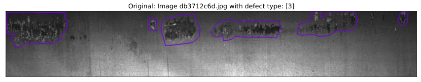

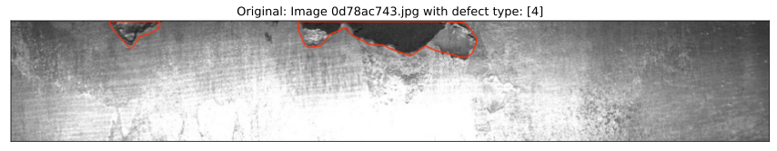

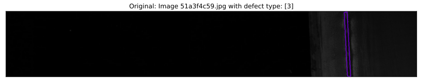

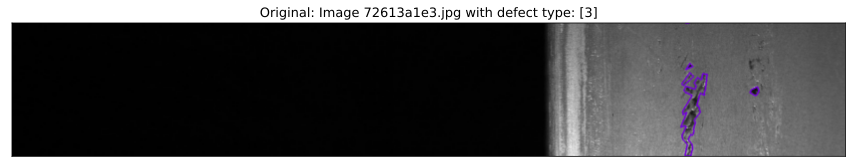

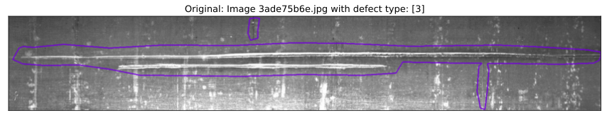

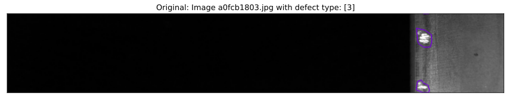


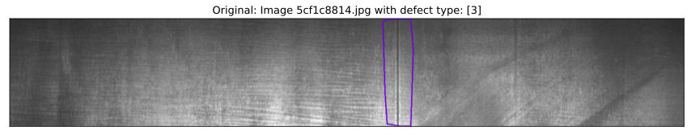


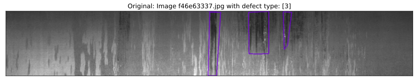

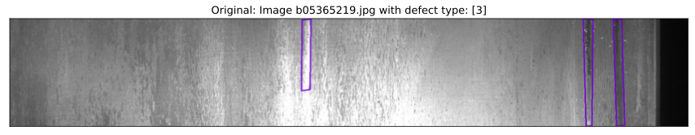

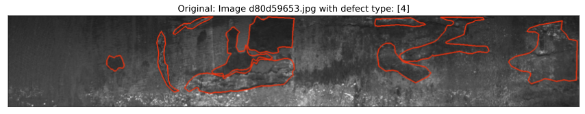

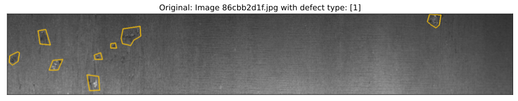


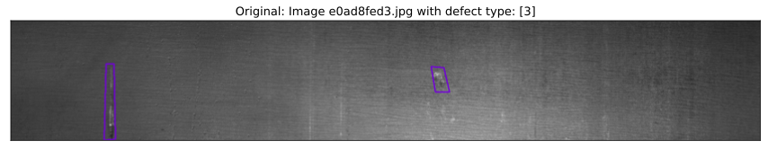

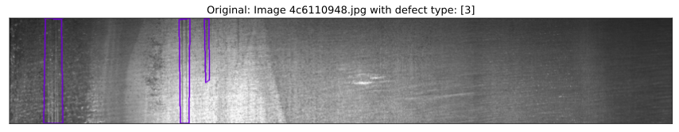


